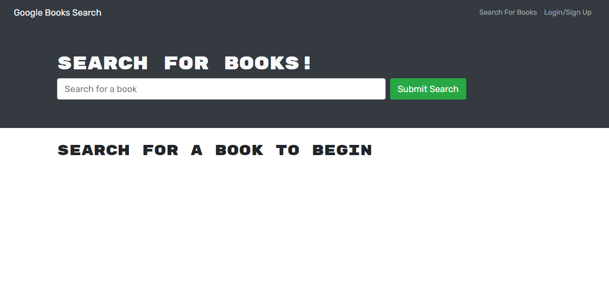
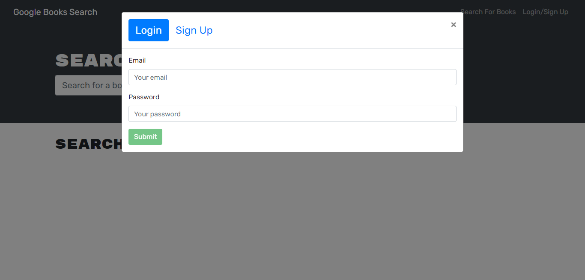
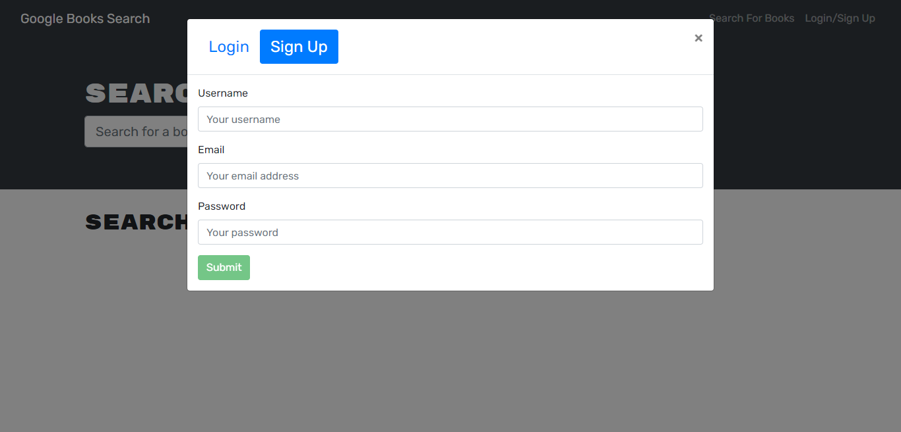
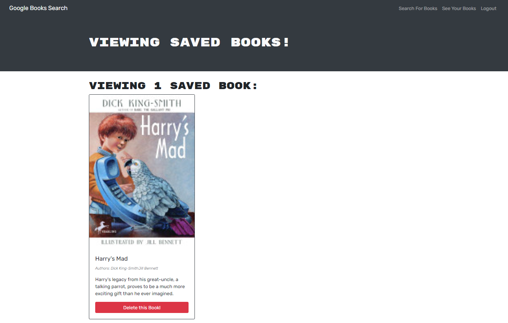

<h1>Book Apollo Refactor</h1>

<h2> Table of Contents </h2>

- [Client](#client)
- [Server](#server)
  - [Running the project](#running-the-project)
  - [Variables](#variables)
  - [Query](#query)
- [me](#me)
  - [Mutation](#mutation)
- [AddUser](#adduser)
- [Login](#login)
- [SaveBook](#savebook)
- [RemoveBook](#removebook)
  - [Screenshoots](#screenshoots)

## Project Link

Click [here](https://warm-escarpment-62722.herokuapp.com/) to view the project on Heroku.

## Getting started

    $ git clone https://github.com/otivisan22/book-apollo-refactor/app
    $ cd book-apollo-refactor
    $ cd client
    $ npm i
    $ cd server
    $ npm i

## Description

This app is book search engine, when you signUp you can search/save and delete books, but the most amazing thing about this is the backend as we have implemented in server.js apollo server and applied to the express server as middleware and and updated the auth middleware function to work with GraphQl Api.

Don't forget to code for fun :rocket: 'cause this is React js. with Apollo Client GraphQl.

## What did we do?

# Client

- npm init
- npm i apollo client
- npm i apollo-client-express

# Server

- npm init
- npm i react router
- npm i graphql
- npm i apollo client
- npm jwd decode
- npm i react bootstrap

## Running the project

```
$ cd client
$ npm init
$ npm start

$ cd server
$ npm init
$ npm run watch

```

## Variables

```
{
  "addUserInput": {
    "username": "ov2",
    "email": "ov2@email.com",
    "password": "password222"
  },
  "loginInput": {
    "email": "bob.smith@email.com",
    "password": "password123"
  },
  "saveBookInput": {
    "bookId": "555",
    "authors": ["Oti Visan"],
    "title": "Coding with Oti",
    "description": "react.js graphql",
    "image": "foo bar",
    "link": "rockingthegraphql.com"
  },
  "removeBookBookId": "123"
}

```

## Query

# me

```
query Query {
  me {
    _id
    username
    email
    bookCount
    savedBooks {
      bookId
      authors
      description
      title
      image
      link
    }
  }
}

```

## Mutation

# AddUser

```
mutation Mutation($addUserInput: AddUserInput!) {
  addUser(input: $addUserInput) {
    token
    user {
      _id
      username
      email
      bookCount
      savedBooks {
        bookId
        authors
        description
        title
        image
        link
      }
    }
  }
}

```

# Login

```
mutation Mutation($loginInput: LoginInput!) {
  login(input: $loginInput) {
    token
    user {
      _id
      username
      email
      bookCount
      savedBooks {
        bookId
        authors
        description
        title
        image
        link
      }
    }
  }
}

```

# SaveBook

```
mutation Mutation($saveBookInput: SaveBookInput!) {
  saveBook(input: $saveBookInput) {
    _id
    username
    email
    bookCount
    savedBooks {
      bookId
      authors
      description
      title
      image
      link
    }
  }
}

```

# RemoveBook

```
mutation Mutation($removeBookBookId: ID!) {
  removeBook(bookId: $removeBookBookId) {
    _id
    username
    email
    bookCount
    savedBooks {
      bookId
      authors
      description
      title
      image
      link
    }
  }
}

```

## Screenshoots






